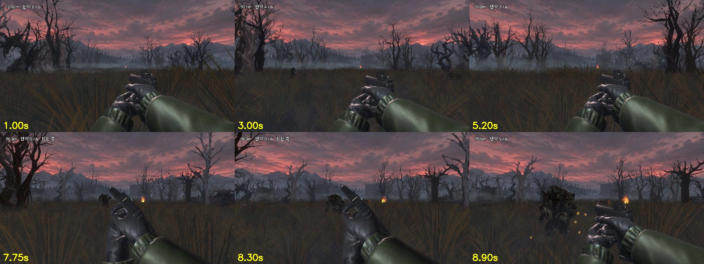
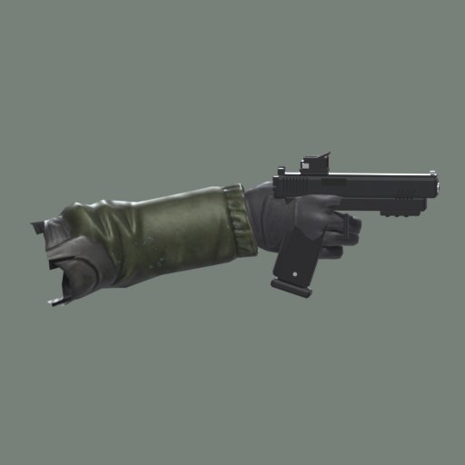
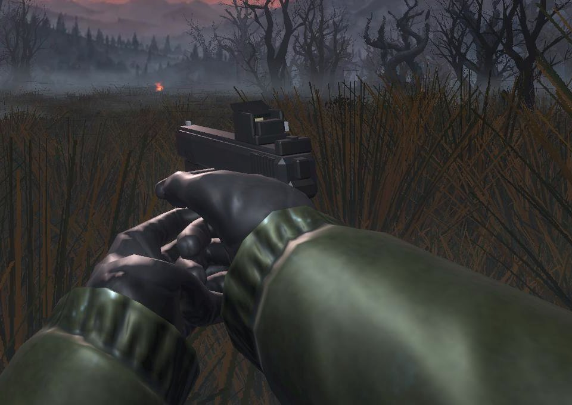

# WU-29 근거 — 새 권총 + 총을 쥔 손 + 조준·사격·장전 시범 동작 (2026-09-30)

## 권총 (`art/blender/make_pistol.py`)
- 사용자가 보여 준 참고 사진(긴 슬라이드 · 빨간 점 조준경 · 오돌토돌한 손잡이)의 **형태만** 참고해 직접 만들었다. 사진은 출처·라이선스를 알 수 없어 쓰지 않았다
- 이전 Quaternius 권총은 사용 안 함 (`ASSETS_LICENSE.md` 에 기록)
- 부품 (B 가 이름으로 찾아 움직인다): `Frame` `Slide`(자식 `Optic`) `Magazine` `Trigger` `HandRight` `HandLeft`
- 총구 = 손잡이 원점에서 Godot (0, 0.055, -0.160) — `muzzle_flash.gd` 의 `MUZZLE` 도 바꿈
- 탄창은 손잡이 축 (0, -0.951, 0.309) 방향으로 빠진다

## 손
- Mixamo `Swat` 캐릭터 + `pistol idle`(Pistol Handgun Locomotion Pack) 10번째 프레임 자세를 굳히고 팔꿈치 아래만 잘랐다
- 소매는 SWAT 파란색을 짙은 올리브로 다시 칠했다 (`--sleeve`, 장갑은 원래 검정)
- 뼈대 없음 → 손은 총과 함께 움직인다. 장전 때 왼손(`HandLeft`)만 통째로 옮긴다 (TECH_SPEC D6 v0.5.4 변경 제안)
- 원본 FBX 는 `art/source/mixamo/swat_pistol/` (git 제외, 재배포 금지)

## 검사 (`validate.py`) — 통과
- 삼각형 3,976 / 상한 5,000 (손을 줄여 맞춤)
- 총 길이 0.214 m (손 제외, 약속 0.2 m ±10%)
- 그림 1024 이하, 부품 7개 모두 있음

## 시범 동작 (`scripts/stage/viewmodel_motion.gd`) — B 가 가져다 쓴다
| 함수 | 하는 일 |
|---|---|
| `aim_at(위치)` | 자동 조준(F-11)이 고른 좀비 쪽으로 총을 돌린다 (좌우 24°·위아래 14° 한계) |
| `fire()` | 반동 + 슬라이드가 뒤로 밀렸다 돌아옴 |
| `reload()` | 총 기울이기 → 탄창 빠짐 → 왼손이 새 탄창 → 끼우기 → 슬라이드 당기기 (약 1.4초), 끝나면 `reloaded` 신호 |

미리보기: `godot --path godot res://scenes/stage/viewmodel_preview.tscn` — 팀 스테이지 맵 위를 달리며 좀비를 자동 조준해 쏘고 6발마다 장전

